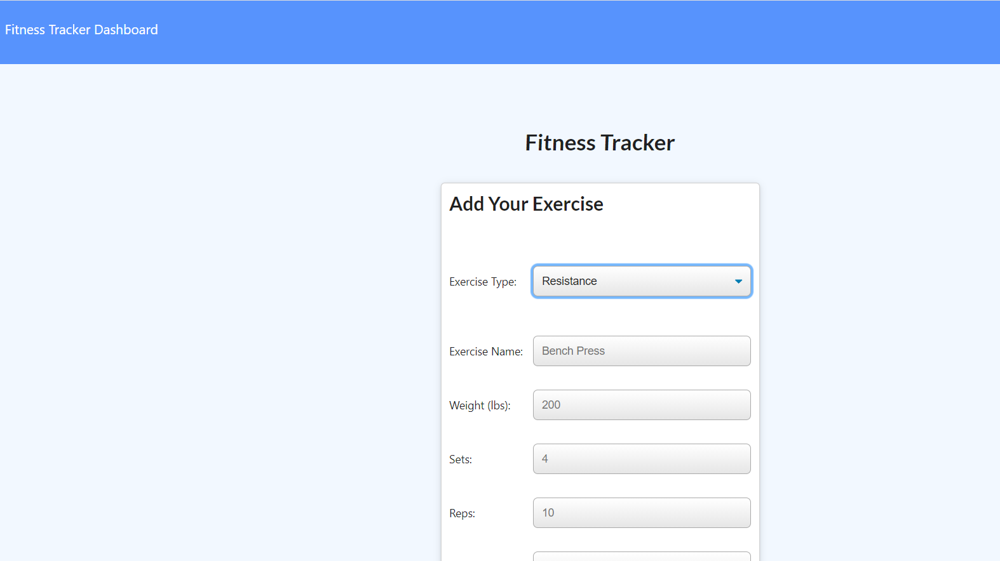

# Unit 17 NoSQL Homework: Workout Tracker

## My task
For this assignment, I will create a workout tracker. This assignment will require you to create Mongo database with a Mongoose schema and handle routes with Express.

## User Story

* As a user, I want to be able to view create and track daily workouts. I want to be able to log multiple exercises in a workout on a given day. I should also be able to track the name, type, weight, sets, reps, and duration of exercise. If the exercise is a cardio exercise, I should be able to track my distance traveled.

## Live deployed Heroku site: 

https://sishir-fitness-tracker.herokuapp.com/

## Github link
https://github.com/sishirbhattarai/fitness-tracker

## License
MIT

## Test:

## Contributors
Sishir Bhattarai

> **Important:** Look into using a MongoDB aggregate function to dynamically add up and return the total duration for each workout. Check out the [MongoDB documentation on the $addFields](https://docs.mongodb.com/manual/reference/operator/aggregation/addFields/), the [MongoDB documentation on the $sum operator](https://docs.mongodb.com/manual/reference/operator/aggregation/sum/), and the [Mongoose documentation on aggregate functions](https://mongoosejs.com/docs/api.html#aggregate_Aggregate) to learn how it can be accomplished.

To deploy an application with a MongoDB database to Heroku, you'll need to set up a MongoDB Atlas account and connect a database from there to your application. Be sure to use the following guides for support:

  * [Set Up MongoDB Atlas](../04-Important/MongoAtlas-Setup.md)

  * [Deploy with Heroku and MongoDB Atlas](../04-Important/MongoAtlas-Deploy.md)

